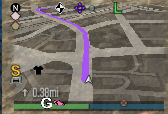
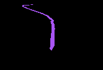
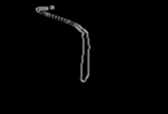

# GTA5-SelfDrive
Deep Learning AI trying to drive on the paths of GTA5 and hopefully not hit any car or pedestrian 🤭

I am training the model on the mini-map image rather than the actual road image. Hope it works!

These are the following I wish to execute in the algorithm:
1. Drive via GPS from the mini-map

      1.a) Also try to orient itself in the direction of GPS lanes if the car gets hit or gets off track.
      
      1.b) Speed and turn control
  
2. Object Detection and avoid collision, overtake, etc.
3. Follow traffic signal 🥱

**PART-1**

This is the mini-map image of GTA5.

I only want to focus on the path. 

Before feeding into model to train, I will also do a **Canny** and **GaussianBlur** on the output image to reduce the dimensionality (from 3 color channels to 1). You can use only **cv2.COLOR_BGR2GRAY** but i figured that training the model on edges rather than whole lanes will easier to compute, memory and time wise.

So, this is final ouput i want to feed in the **Alexnet** model to train (I will try to use GoogleNet later)
