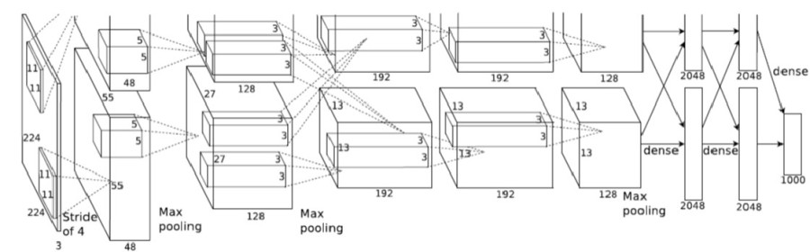

# GTA5-SelfDrive
Deep Learning AI trying to drive on the paths of GTA5 and hopefully not hit any car or pedestrian 🤭

I am training the model on the mini-map image rather than the actual road image. Hope it works!

These are the following I wish to execute in the algorithm:
1. Drive via GPS from the mini-map

      1.a) Also try to orient itself in the direction of GPS lanes if the car gets hit or gets off track.
      
      1.b) Speed and turn control
  
2. Object Detection and avoid collision, overtake, etc.
3. Follow traffic signal 🥱

**PART-1**

I am using **Alexnet** model to train (I will try to use GoogleNet later)

This is the architecture:

I am using 160x120x3 input shape rather than 224x224x3. If the loss is high then i will revert back to 224x224x3.

Also see 3 - RGB channels. We can **GRAYSCALE** and then pass but i didn't bother as Alexnet prefers **RGB** image !?

This is the mini-map image of GTA5.

I only want to focus on the path. 

So, this is final ouput i want to feed to the Alexnet model.

